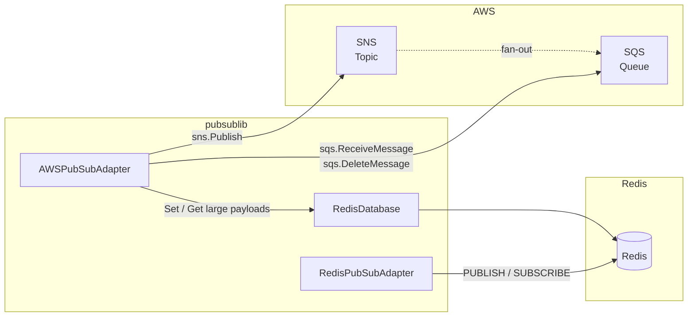
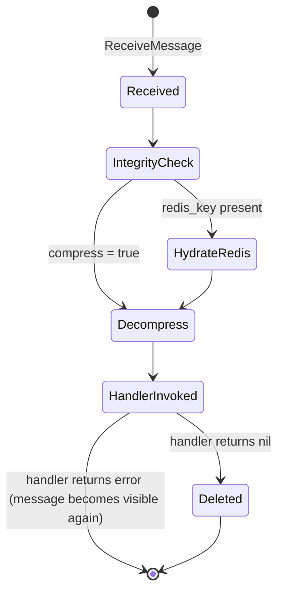

# Integrations

`pubsublib` integrates with three external systems: **AWS SNS**, **AWS SQS**, and **Redis**. This document describes each integration, its configuration surface, and the data contracts it enforces.

---

## Integration Map



---

## 1. AWS SNS

### Purpose
Publishing messages to SNS topics; fan-out to one or more SQS queues is handled by AWS infrastructure.

### SDK
`github.com/aws/aws-sdk-go` — `service/sns`

### Session initialisation
```go
// Static credentials (CI, local dev)
awsConfig.Credentials = credentials.NewStaticCredentials(accessKeyId, secretAccessKey, "")

// IRSA / Instance profile (Kubernetes, ECS) — pass empty strings
awsConfig := &aws.Config{Region: aws.String(region)}
sess, _ := session.NewSession(awsConfig)
```

### Endpoint override
Set `snsEndpoint` to a non-empty string (e.g. `http://localhost:4566` for LocalStack) to redirect all SNS calls.

### Standard topic publish

```go
ps.snsSvc.Publish(&sns.PublishInput{
    Message:           aws.String(messageBody),
    TopicArn:          aws.String(topicARN),
    MessageAttributes: awsMessageAttributes,
})
```

### FIFO topic publish

For `.fifo` topics, pass `messageGroupId` and `messageDeduplicationId`:

```go
publishMessage.MessageGroupId          = aws.String(messageGroupId)
publishMessage.MessageDeduplicationId = aws.String(messageDeduplicationId)
```

### Required message attributes

| Attribute | Type | Description |
|---|---|---|
| `source` | `String` | Originating service identifier |
| `contains` | `String` | Entity type carried in the payload |
| `event_type` | `String` | Semantic event name (e.g. `user.created`) |
| `trace_id` | `String` | Distributed trace ID; auto-generated (UUID v4) if absent |

### Optional message attributes

| Attribute | Type | Set by |
|---|---|---|
| `compress` | `String` (`"true"`) | Library when compression is enabled |
| `redis_key` | `String` (UUID) | Library when payload exceeds 200 KB |

---

## 2. AWS SQS

### Purpose
Polling and consuming messages forwarded by SNS fan-out subscriptions.

### SDK
`github.com/aws/aws-sdk-go` — `service/sqs` / `sqsiface`

### Poll parameters

| Parameter | Value | Notes |
|---|---|---|
| `MaxNumberOfMessages` | `10` | Maximum batch per call |
| `VisibilityTimeout` | `5 s` | Window to process before message re-appears |
| `MessageAttributeNames` | `["All"]` | Retrieve all custom attributes |
| `AttributeNames` | `["All"]` | Retrieve all system attributes |

### Message lifecycle



### Message integrity
Each message body is MD5-hashed and compared against the `MD5OfBody` field provided by SQS. A mismatch returns an error and halts processing of the batch.

---

## 3. Redis — Overflow Store (`infrastructure/RedisDatabase`)

### Purpose
Transparently storing message bodies that exceed the SNS/SQS 256 KB limit.

### SDK
`github.com/go-redis/redis/v8`

### Key schema

```
PUBSUB:<uuid>
```

- TTL: **2 minutes** (hardcoded)
- Value: JSON-serialised message body (string)
- The UUID is generated at publish time and passed as the `redis_key` SNS message attribute.

### Connection options

| Option | Constructor parameter |
|---|---|
| Address | `redisAddress` |
| Password | `redisPassword` |
| DB index | `redisDB` |
| Pool size | `redisPoolSize` |
| Min idle conns | `redisMinIdleConn` |

### Singleton behaviour
`NewRedisDatabase` returns the existing `Rdb` singleton on subsequent calls — safe to call multiple times; only one connection pool is created per process.

---

## 4. Redis — Pub/Sub Transport (`provider/redis/RedisPubSubAdapter`)

### Purpose
Native Redis Pub/Sub as an alternative to SNS/SQS (primarily for local development and intra-service communication).

### SDK
`github.com/go-redis/redis/v8`

### Publish contract
Wraps message and attributes into:
```json
{
  "messageAttributs": { "source": "...", "contains": "...", "eventType": "..." },
  "message": { ... }
}
```
> Note: `messageAttributs` is a known typo preserved for backwards compatibility.

### Subscribe behaviour
`PollMessages` opens a subscription on the given topic channel and loops indefinitely, invoking the handler for each received payload. The subscriber blocks until the context or channel is closed.

---

## Dependency Versions

| Library | Import path | Purpose |
|---|---|---|
| aws-sdk-go | `github.com/aws/aws-sdk-go` | SNS/SQS client |
| go-redis | `github.com/go-redis/redis/v8` | Redis client |
| uuid | `github.com/google/uuid` | UUID v4 generation |
| errors | `github.com/pkg/errors` | Error wrapping |
