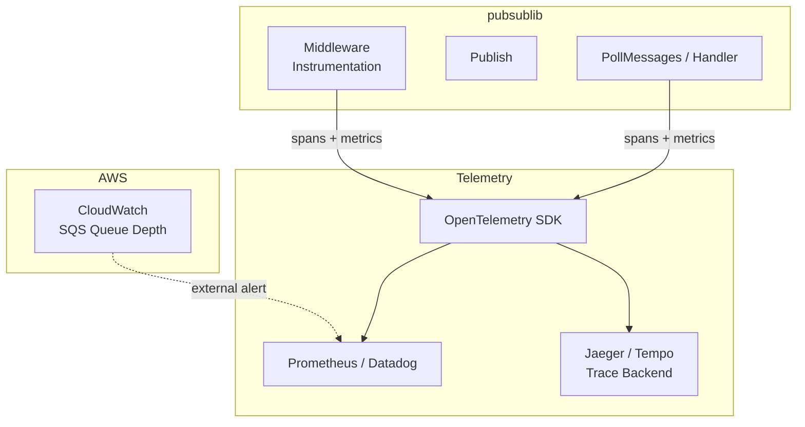

# Observability

This document describes the built-in observability primitives in `pubsublib` and recommended patterns for adding instrumentation in consuming services.

---

## Built-in Observability

### Distributed Tracing — `trace_id`

Every publish call automatically injects a `trace_id` message attribute if one is not already provided by the caller:

```go
if messageAttributes["trace_id"] == nil {
    messageAttributes["trace_id"] = uuid.New().String()
}
```

`trace_id` is propagated as an SNS message attribute and is available to consumers via `message.MessageAttributes["trace_id"]`. Services should read this value and forward it to their internal tracing infrastructure (e.g. OpenTelemetry, Datadog).

---

### Error Surfaces

All errors are returned up the call stack — the library does not swallow errors silently. The following operations return errors that callers must handle:

| Operation | Error condition |
|---|---|
| `NewAWSPubSubAdapter` | AWS session creation fails; Redis ping fails |
| `Publish` | Missing required attributes; JSON marshal failure; Redis Set failure; SNS API error |
| `PollMessages` | SQS ReceiveMessage failure; MD5 mismatch; Redis Get failure; handler returns error; SQS DeleteMessage failure |
| `NewRedisDatabase` | Redis ping fails |

---

### Structured Log Statements

The infrastructure layer emits log lines via the standard `log` package:

| Location | Event |
|---|---|
| `infrastructure/redis-client.go` | Key not found in Redis (`"Key does not exist: <key>"`) |
| `infrastructure/redis-client.go` | Redis Get error (`"Error while fetching data from redis. Key,value ..."`) |
| `infrastructure/redis-client.go` | JSON unmarshal error |
| `infrastructure/redis-client.go` | Key deletion (`"Deleting following key from redis: <key>"`) |

---

## Recommended Instrumentation Patterns

### 1. Publish Latency & Error Rate via Middleware

Implement `pubsub.Middleware` to wrap every publish call with metrics and traces:

```go
type InstrumentedMiddleware struct {
    meter  metric.Meter   // OpenTelemetry meter
    tracer trace.Tracer   // OpenTelemetry tracer
}

func (m *InstrumentedMiddleware) PublisherMsgInterceptor(
    serviceName string,
    next pubsub.PublishHandler,
) pubsub.PublishHandler {
    return func(topicARN string, msg interface{}, attrs map[string]interface{}) error {
        ctx, span := m.tracer.Start(context.Background(), "pubsub.publish",
            trace.WithAttributes(
                attribute.String("topic", topicARN),
                attribute.String("service", serviceName),
            ),
        )
        defer span.End()

        start := time.Now()
        err := next(topicARN, msg, attrs)
        duration := time.Since(start)

        // record metrics
        m.meter.Int64Histogram("pubsub.publish.duration_ms").Record(ctx, duration.Milliseconds())
        if err != nil {
            span.RecordError(err)
            m.meter.Int64Counter("pubsub.publish.errors").Add(ctx, 1)
        }
        return err
    }
}
```

Register it at client construction:

```go
client := &pubsub.Client{
    ServiceName: "my-service",
    Provider:    awsAdapter,
    Middleware:  []pubsub.Middleware{&InstrumentedMiddleware{meter, tracer}},
}
```

---

### 2. Consumer Observability

Because `PollMessages` accepts a handler function, consumers instrument the handler directly:

```go
awsAdapter.PollMessages(queueURL, func(msg *sqs.Message) error {
    traceID := ""
    if attr, ok := msg.MessageAttributes["trace_id"]; ok && attr.StringValue != nil {
        traceID = *attr.StringValue
    }

    ctx := injectTraceID(context.Background(), traceID)
    _, span := tracer.Start(ctx, "pubsub.consume")
    defer span.End()

    start := time.Now()
    err := processMessage(msg)
    recordConsumerMetrics(time.Since(start), err)
    return err
})
```

---

### 3. Recommended Metrics

| Metric name | Type | Labels | Description |
|---|---|---|---|
| `pubsub.publish.duration_ms` | Histogram | `topic`, `service`, `status` | End-to-end publish latency |
| `pubsub.publish.errors` | Counter | `topic`, `service`, `error_type` | Publish error count |
| `pubsub.consume.duration_ms` | Histogram | `queue`, `service`, `status` | Handler processing latency |
| `pubsub.consume.errors` | Counter | `queue`, `service`, `error_type` | Consumer error count |
| `pubsub.redis_overflow.count` | Counter | `topic` | Messages offloaded to Redis |
| `pubsub.compression.count` | Counter | `topic` | Messages compressed |

---

### 4. Alerting Recommendations

| Signal | Suggested threshold | Severity |
|---|---|---|
| Publish error rate | > 1% over 5 min | Warning |
| Publish error rate | > 5% over 2 min | Critical |
| Consumer error rate | > 1% over 5 min | Warning |
| SQS queue depth (CloudWatch) | > 1000 messages | Warning |
| Redis key count `PUBSUB:*` | > 500 | Warning (overflow volume spike) |
| Redis connection pool saturation | > 90% | Critical |

---

## Observability Architecture Diagram


