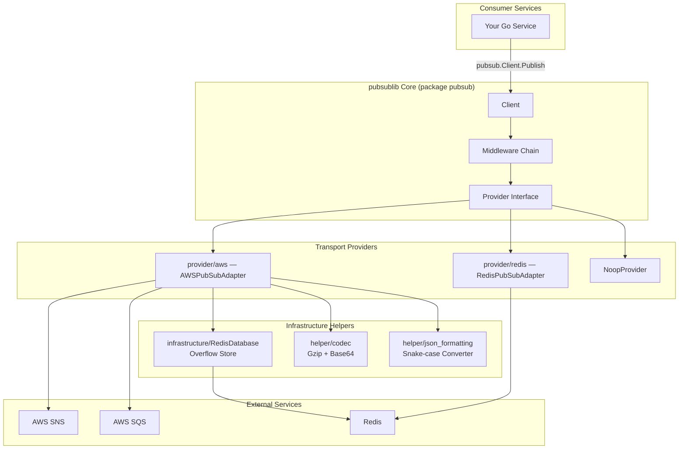
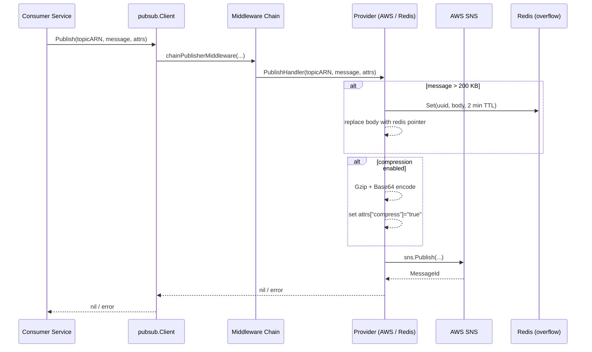
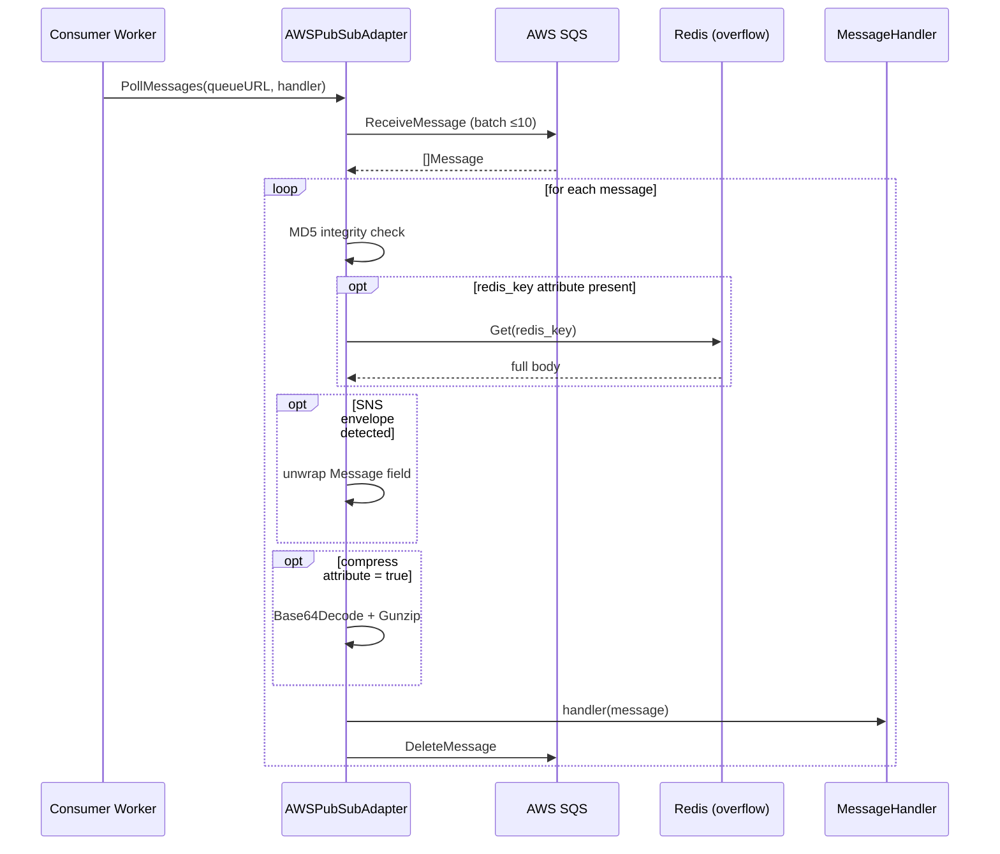

# pubsublib — Architecture Overview

`pubsublib` is a Go library that provides a unified publish/subscribe abstraction over multiple message-transport backends. Consuming services import the library, initialise the adapter of their choice, and interact through a single, stable API surface — without coupling their business logic to a specific broker.

---

## High-Level Component Map



---

## Core Abstractions

| Abstraction | Location | Purpose |
|---|---|---|
| `Provider` | `pubsub.go` | Interface that every transport adapter implements (`Publish`, `PollMessages`) |
| `Client` | `pubsub.go` | Holds a `Provider` reference and an ordered `Middleware` slice; exposes `Publish` |
| `Middleware` | `pubsub.go` | Interceptor interface; allows cross-cutting concerns (logging, tracing, retry) on publish |
| `MessageHandler` | `pubsub.go` | `func(string) error` callback used by the base provider contract |
| `NoopProvider` | `noop.go` | No-op implementation; default out-of-the-box so tests never need real brokers |

---

## Publish Flow



---

## Poll / Consume Flow



---

## Package Layout

```
pubsublib/
├── pubsub.go               # Core types: Client, Provider, Middleware, MessageHandler
├── public.go               # Client.Publish + middleware chaining
├── noop.go                 # NoopProvider (default / test stub)
│
├── provider/
│   ├── aws/
│   │   └── aws.go          # AWSPubSubAdapter: SNS publish, SQS poll, Redis overflow
│   └── redis/
│       └── redis.go        # RedisPubSubAdapter: native Redis Pub/Sub
│
├── infrastructure/
│   └── redis-client.go     # Singleton RedisDatabase (go-redis/v8); keys prefixed PUBSUB:
│
├── helper/
│   ├── codec.go            # Gzip compress/decompress; Base64 encode/decode
│   └── json_formatting.go  # Recursive camelCase → snake_case map conversion
│
└── .github/
    ├── CODEOWNERS
    └── PULL_REQUEST_TEMPLATE.md
```

---

## Design Principles

1. **Provider-agnostic interface** — swap AWS for Redis (or a future Kafka adapter) with zero changes to business logic.
2. **Composable middleware** — interceptors stack in reverse-registration order, enabling clean separation of cross-cutting concerns without modifying the core path.
3. **Large-message transparency** — payloads exceeding the SNS/SQS 256 KB limit are automatically offloaded to Redis; consumers transparently retrieve and hydrate the full body.
4. **Optional compression** — gzip + base64 is opt-in via an environment variable, keeping the hot path lean for small payloads.
5. **Zero-dependency default** — `NoopProvider` is registered as the default client so imported packages never panic during tests or cold starts.
