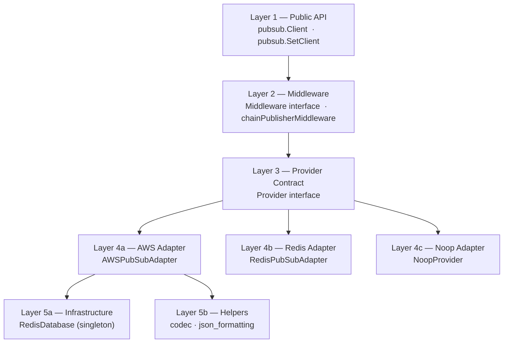
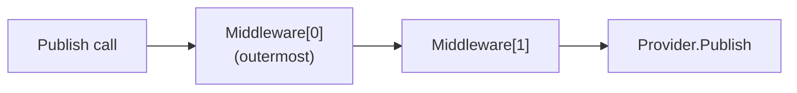

# Service Layer

This document describes every layer of the library from the public API surface down to the infrastructure utilities.

---

## Layer Diagram



---

## Layer 1 — Public API (`pubsub` package)

### `Client`

```go
type Client struct {
    ServiceName string
    Provider    Provider
    Middleware  []Middleware
}
```

| Field | Description |
|---|---|
| `ServiceName` | Injected into every `PublisherMsgInterceptor` call; used for tracing/logging middleware |
| `Provider` | The active transport backend |
| `Middleware` | Ordered slice of interceptors applied on every `Publish` call |

**`Client.Publish`** (`public.go`) chains all middleware in reverse-registration order then delegates to `Provider.Publish`.

**`SetClient`** replaces the package-level `clients` singleton — intended for test setup to inject mocks.

---

## Layer 2 — Middleware (`pubsub` package)

```go
type Middleware interface {
    PublisherMsgInterceptor(serviceName string, next PublishHandler) PublishHandler
}
```

`chainPublisherMiddleware` wraps middleware in a LIFO stack so the first registered middleware is the outermost interceptor:



Implementing a middleware:

```go
type LoggingMiddleware struct{}

func (l LoggingMiddleware) PublisherMsgInterceptor(svcName string, next pubsub.PublishHandler) pubsub.PublishHandler {
    return func(topicARN string, msg interface{}, attrs map[string]interface{}) error {
        log.Printf("[%s] publishing to %s", svcName, topicARN)
        err := next(topicARN, msg, attrs)
        log.Printf("[%s] result: %v", svcName, err)
        return err
    }
}
```

---

## Layer 3 — Provider Contract

```go
type Provider interface {
    Publish(topicARN string, message interface{}, messageAttributes map[string]interface{}) error
    PollMessages(queueURL string, handler MessageHandler) error
}
```

> **Note**: `AWSPubSubAdapter` intentionally does **not** implement the core `Provider` interface directly — its `Publish` and `PollMessages` signatures carry additional AWS-specific parameters (`messageGroupId`, `messageDeduplicationId`, typed SQS handler). Use `AWSPubSubAdapter` directly rather than through `pubsub.Client` when FIFO support is required.

---

## Layer 4a — AWS Adapter (`provider/aws`)

**`AWSPubSubAdapter`** — the primary production adapter.

### Construction

```go
func NewAWSPubSubAdapter(
    region, accessKeyId, secretAccessKey string,
    snsEndpoint string,
    redisAddress, redisPassword string,
    redisDB, redisPoolSize, redisMinIdleConn int,
) (*AWSPubSubAdapter, error)
```

Pass empty strings for `accessKeyId` / `secretAccessKey` to use **IRSA** (IAM Roles for Service Accounts) — the SDK falls back to the environment credential chain.

### Publish responsibilities

1. Map keys converted to `snake_case` via `helper.ConvertBodyToSnakeCase`.
2. JSON serialise the message.
3. **Optional compression** — if `PUBSUBLIB_COMPRESSION_ENABLED=true|1`, gzip-compress and base64-encode; set `messageAttributes["compress"]="true"`.
4. **Large-message overflow** — if serialised body > 200 KB, store in Redis under a UUID key (`PUBSUB:<uuid>`, TTL 2 min) and replace the body with a pointer string.
5. Validate required attributes: `source`, `contains`, `event_type`. Auto-inject `trace_id` (UUID v4) if absent.
6. Convert `messageAttributes` to `*sns.MessageAttributeValue` map via `BindAttributes`.
7. Call `snsSvc.Publish`; optionally set `MessageGroupId` and `MessageDeduplicationId` for FIFO topics.

### PollMessages responsibilities

1. Receive up to 10 messages from SQS with a 5-second visibility timeout.
2. MD5 integrity check — abort with error on mismatch.
3. **Redis key hydration** — if `redis_key` attribute present, fetch body from Redis.
4. **SNS envelope detection** — unwrap the `Message` field when the body is an SNS notification envelope.
5. **Decompression** — Base64-decode then gunzip when `compress="true"`.
6. Invoke handler; delete message from queue on success.

### Attribute type mapping (`BindAttributes`)

| Go type | SNS `DataType` |
|---|---|
| `string` | `String` |
| `int`, `float64`, … | `Number` |
| `[]string` | `String.Array` |

---

## Layer 4b — Redis Adapter (`provider/redis`)

**`RedisPubSubAdapter`** — lightweight Redis Pub/Sub transport.

```go
func NewRedisPubSubAdapter(addr string) (*RedisPubSubAdapter, error)
```

- `Publish`: validates `source`, `contains`, `eventType` attributes; wraps message and attributes into a single JSON object; calls `client.Publish`.
- `PollMessages`: subscribes to the topic channel; loops over `pubsub.Channel()` invoking the handler for each payload.

> This adapter is suitable for **intra-datacenter** or **dev/test** scenarios where AWS is unavailable.

---

## Layer 4c — Noop Adapter (`noop.go`)

`NoopProvider` silently discards all publish and poll calls. It is the package-level default, ensuring no nil-pointer panics when a service is initialised without an explicit adapter.

---

## Layer 5a — Infrastructure (`infrastructure/redis-client.go`)

**`RedisDatabase`** wraps `go-redis/v8` with:

| Feature | Detail |
|---|---|
| Singleton pattern | `NewRedisDatabase` returns the existing `Rdb` if already initialised |
| Key prefix | All keys are stored as `PUBSUB:<key>` |
| Pool configuration | `poolSize` / `minIdleConns` tunable at construction |
| TTL unit | `Set` accepts `expiryTime` in **minutes** |
| Liveness check | `client.Ping` at construction; returns error if unreachable |

Operations: `Set`, `Get` (JSON marshal/unmarshal), `Delete`.

---

## Layer 5b — Helpers

### `helper/codec.go`

| Function | Description |
|---|---|
| `GzipCompress(data, level)` | Compress bytes at a given gzip level |
| `GzipDecompress(data)` | Decompress gzip bytes |
| `Base64Encode(data)` | Standard base64 encode |
| `Base64Decode(s)` | Standard base64 decode |
| `GzipAndBase64(data, level)` | Compress then encode — returns base64 string |
| `GzipAndBase64Best(data)` | `GzipAndBase64` at `BestCompression` level |
| `Base64DecodeAndGunzipIf(b64, compressed)` | Decode and conditionally decompress |

### `helper/json_formatting.go`

`ConvertBodyToSnakeCase` recursively walks a `map[string]interface{}` and converts every key from camelCase to snake_case. Handles nested maps and slices of maps.
